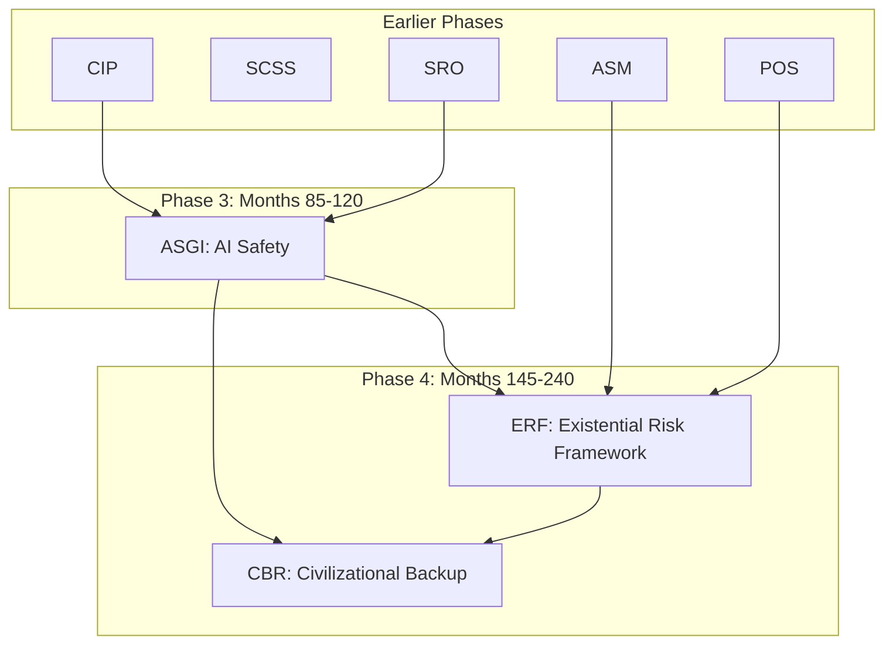

# Phase 3-4 Master Plan: AI Safety & Existential Risk Management

**Version:** 1.0  
**Date:** 2026-01-30  
**Scope:** Phase 3 (Months 85-120) + Phase 4 (Months 145-240)  
**Status:** Specification Complete  

---

## Executive Summary

Этот документ объединяет спецификации Phase 3 (ASGI) и Phase 4 (ERF/CBR) в единый мета-план для управления:
- **AI Safety** — надзор за ИИ-системами (ASGI)
- **Existential Risks** — приоритизация рисков уровня вымирания (ERF/CBR)

**Ключевая связь:** ASGI → ERF/CBR

```
ASGI (Phase 3):
├─ КАК следить за ИИ
├─ Target AI → Monitor LLM → Policy Engine
├─ Red-Team, OPA, Trust Decay
└─ Предотвращение x-risk от AI

ERF/CBR (Phase 4):
├─ ЧТО приоритизировать (какие x-risks)
├─ Tier X / 1 / 2 / 3 classification
├─ P(extinction) calculation
└─ Civilizational backup
```

---

## 1. Problem Statement

### 1.1 Текущая ситуация

```
Модули платформы сейчас:
├─ CIP: Infrastructure failures (catastrophic, но не existential)
├─ SCSS: Supply chain collapse (severe economic damage, но выживаемо)
├─ SRO: Financial contagion (Great Depression scale, но не extinction)
├─ ASM: Geopolitical conflict (including nuclear war - EXISTENTIAL)
└─ ASGI: AI risks (potential EXISTENTIAL)

НО: Нет единой системы приоритизации по критерию "extinction risk"
```

### 1.2 Решение

```
Phase 3 → ASGI:
├─ AI System Registry
├─ Oversight Pipeline (Target → Monitor → Policy)
├─ Capability emergence detection
└─ Goal drift prevention

Phase 4 → ERF/CBR:
├─ Existential Risk Framework (мета-слой)
├─ P(extinction) для каждого риска
├─ Longtermist decision optimizer
└─ Civilizational backup protocols
```

---

## 2. Module Architecture

### 2.1 High-Level Architecture

```
┌─────────────────────────────────────────────────────────────────────┐
│                    STRATEGIC MODULES PLATFORM                        │
├─────────────────────────────────────────────────────────────────────┤
│                                                                       │
│  ┌─────────────────────────────────────────────────────────────┐   │
│  │ ERF: EXISTENTIAL RISK FRAMEWORK (META-LAYER)                │   │
│  │                                                               │   │
│  │  • Classifies all risks by extinction potential              │   │
│  │  • Prioritizes Tier X > Tier 1 > Tier 2 > Tier 3            │   │
│  │  • Cross-domain integration (AI + Bio + Nuclear + Climate)   │   │
│  │  • Longtermist decision support                              │   │
│  │  • P(extinction) = ~16% by 2100                              │   │
│  └───────────────────────────┬───────────────────────────────────┘   │
│                              │                                       │
│                              ▼ (prioritizes)                         │
│  ┌─────────────────────────────────────────────────────────────┐   │
│  │               DOMAIN-SPECIFIC MODULES                        │   │
│  ├─────────────────────────────────────────────────────────────┤   │
│  │                                                               │   │
│  │  ASGI: AI Safety           X-Risk: Unaligned AGI (P=10%)    │   │
│  │  ├─ AI System Registry                                       │   │
│  │  ├─ Oversight Pipeline                                       │   │
│  │  ├─ Capability Emergence Detection                           │   │
│  │  └─ ASGI_SENTINEL agent                                      │   │
│  │                                                               │   │
│  │  ASM: Strategic Mapping    X-Risk: Nuclear war (P=1%)       │   │
│  │  POS: Planetary System     X-Risk: Climate (P=1%)           │   │
│  │  BIOSEC: Biosecurity       X-Risk: Pandemic (P=3%) [NEW]    │   │
│  │                                                               │   │
│  │  CBR: Civilizational Backup                                  │   │
│  │  ├─ Knowledge preservation                                   │   │
│  │  ├─ Recovery protocols                                       │   │
│  │  └─ CBR_ANALYST agent                                        │   │
│  └─────────────────────────────────────────────────────────────┘   │
│                                                                       │
└─────────────────────────────────────────────────────────────────────┘
```

### 2.2 ASGI Oversight Pipeline

```
┌─────────────────────────────────────────────────────────────────────┐
│                    ASGI: AI OVERSIGHT PIPELINE                       │
├─────────────────────────────────────────────────────────────────────┤
│                                                                       │
│  [ Input / Task ]                                                    │
│        ↓                                                             │
│  ┌──────────────┐                                                    │
│  │  TARGET AI   │  ← Qwen2.5-32B / Llama 3.1-70B                    │
│  └──────┬───────┘                                                    │
│         ↓ (Action Plan JSON)                                         │
│  ┌──────────────┐                                                    │
│  │   SCHEMA     │  ← JSON Schema validation                         │
│  │  VALIDATOR   │                                                    │
│  └──────┬───────┘                                                    │
│         ↓                                                             │
│  ┌──────────────┐   ┌──────────────┐                                │
│  │ MONITOR A    │   │ MONITOR B    │  ← Nemotron-4 / Qwen           │
│  └──────┬───────┘   └──────┬───────┘                                │
│         └────────┬─────────┘                                         │
│                  ↓                                                    │
│  ┌──────────────────┐                                                │
│  │  RISK AGGREGATOR │  ← risk=max(), confidence=min()               │
│  └────────┬─────────┘                                                │
│           ↓                                                           │
│  ┌──────────────────┐                                                │
│  │  POLICY ENGINE   │  ← OPA/Rego (NO LLM!)                         │
│  │  (Deterministic) │                                                │
│  └────────┬─────────┘                                                │
│           ↓                                                           │
│  ┌──────────────────┐                                                │
│  │ EXECUTION LAYER  │  ← ALLOW / BLOCK / SANDBOX / ESCALATE         │
│  └──────────────────┘                                                │
│                                                                       │
│  [ Async: RED-TEAM LLM ] → Attack patterns → Policy updates         │
│  [ Async: TRUST DECAY  ] → Model trust scores                        │
│                                                                       │
└─────────────────────────────────────────────────────────────────────┘
```

### 2.3 ERF Risk Tiering

```
TIER X: EXISTENTIAL (P > 0.1% → ACT IMMEDIATELY)
├─ Unaligned AGI        [10%]  → ASGI module
├─ Engineered Pandemic  [3%]   → BIOSEC module (NEW)
├─ Nuclear Winter       [1%]   → ASM module
├─ Runaway Climate      [1%]   → POS module
└─ Unknown Unknowns     [1%]   → CBR module

TIER 1: CATASTROPHIC (P > 1% → ACT)
├─ Regional nuclear war
├─ Natural pandemic (COVID x100)
└─ Major infrastructure cascade

TIER 2: SEVERE (P > 5% → MONITOR)
├─ Financial crisis
├─ Cyberattack
└─ Natural disasters

TIER 3: MANAGEABLE (NORMAL RESPONSE)
├─ Industrial accidents
├─ Localized conflicts
└─ Economic recession
```

---

## 3. Implementation Roadmap

### 3.1 Combined Timeline

```
PHASE 3: ASGI (Months 85-120)
──────────────────────────────────────────────────────────────────────

Year 8 (Months 85-96): Foundation
├─ Month 85-87: Database schema, AI System Registry MVP
├─ Month 88-90: Compute Cluster monitoring, basic audit
├─ Month 91-93: Target → Monitor → Policy Engine
└─ Month 94-96: Dual-monitor, Risk Aggregator, OPA

Year 9 (Months 97-108): Core Features
├─ Month 97-99: Red-Team LLM automation
├─ Month 100-102: Trust Decay mechanism
├─ Month 103-105: Attack pattern detection
└─ Month 106-108: ASGI_SENTINEL agent

Year 10 (Months 109-120): Production
├─ Month 109-111: AI Safety Institute partnerships
├─ Month 112-114: Compliance reporting
├─ Month 115-117: International protocols
└─ Month 118-120: 50+ AI systems, $25M ARR

PHASE 4: ERF/CBR (Months 145-240)
──────────────────────────────────────────────────────────────────────

Year 13-15 (Months 145-180): ERF Foundation
├─ Month 145-152: X-Risk registry, database schema
├─ Month 153-160: Probability calculator (Monte Carlo)
├─ Month 161-168: Correlation matrix, scenario modeling
├─ Month 169-176: Longtermist decision optimizer
└─ Month 177-180: ERF dashboard (Tier X only)

Year 16-17 (Months 181-204): CBR Foundation
├─ Month 181-188: Knowledge artifact registry
├─ Month 189-196: Criticality scoring, preservation planning
├─ Month 197-200: CBR_ANALYST agent
└─ Month 201-204: Recovery protocols

Year 18-20 (Months 205-240): Production
├─ Month 205-216: Cross-domain analysis
├─ Month 217-228: Long-termist philanthropy partnerships
├─ Month 229-236: 10,000+ artifacts preserved
└─ Month 237-240: All modules operational, $300M ARR
```

### 3.2 Gantt Chart (Simplified)

```
         Year 8    Year 9    Year 10   ...   Year 13   Year 14   Year 15   Year 16-20
         ─────────────────────────────────────────────────────────────────────────────
ASGI     ████████  ████████  ████████
                   ▲                  
                   │ AI Safety Institute partnerships
                   
ERF                                          ████████  ████████  ████████
                                                       ▲
                                                       │ Monte Carlo, Scenarios
                                                       
CBR                                                              ████████  ████████████
                                                                          ▲
                                                                          │ 10K artifacts
```

---

## 4. Module Dependencies

### 4.1 Dependency Graph



### 4.2 Data Flow

```
CIP/SCSS/SRO (Phase 1) → Infrastructure/Supply/Financial risks
        ↓
ASM/POS (Phase 2-3) → Strategic/Climate risks
        ↓
ASGI (Phase 3) → AI risks + Oversight of all AI agents
        ↓
ERF (Phase 4) → Unified P(extinction) calculation
        ↓
CBR (Phase 4) → Knowledge preservation based on ERF priorities
```

---

## 5. Team & Budget

### 5.1 Team Requirements

| Module | Team Size | Key Skills |
|--------|-----------|------------|
| ASGI | 5-8 | AI safety, governance, LLM engineering, OPA/Rego |
| ERF | 3-4 | Probabilistic modeling, risk analysis, longtermism |
| CBR | 4-6 | Knowledge engineering, preservation, cross-domain |
| **Total** | **12-18** | |

### 5.2 Budget Estimate

| Phase | Module | Timeline | Budget |
|-------|--------|----------|--------|
| 3 | ASGI | Months 85-120 (36m) | $8-12M |
| 4 | ERF | Months 145-180 (36m) | $5-8M |
| 4 | CBR | Months 181-240 (60m) | $10-15M |
| **Total** | | | **$23-35M** |

### 5.3 ARR Projections

| Module | Year 10 | Year 15 | Year 20 |
|--------|---------|---------|---------|
| ASGI | $25M | $40M | $60M |
| ERF | — | $10M | $15M |
| CBR | — | $20M | $30M |
| **Total** | $25M | $70M | $105M |

---

## 6. Key Technical Components

### 6.1 ASGI Components

| Component | Description | Technology |
|-----------|-------------|------------|
| AI System Registry | Database of all AI systems | PostgreSQL |
| Compute Monitoring | GPU cluster utilization | Prometheus + custom |
| Oversight Pipeline | Target → Monitor → Policy | FastAPI + LLM APIs |
| Risk Aggregator | Dual-monitor aggregation | Python |
| Policy Engine | Deterministic rules | OPA/Rego |
| Red-Team LLM | Automated attack simulation | Llama 3.1-70B |
| Trust Decay | Dynamic model trust | Custom algorithm |
| ASGI_SENTINEL | Meta-monitoring agent | Agent framework |

### 6.2 ERF/CBR Components

| Component | Description | Technology |
|-----------|-------------|------------|
| X-Risk Registry | All existential risks | PostgreSQL |
| Probability Calculator | P(extinction) estimation | Python + NumPy |
| Monte Carlo Engine | 10,000+ scenario simulation | Python |
| Correlation Matrix | Risk interdependencies | NumPy |
| Decision Optimizer | Longtermist EV calculation | Python |
| Artifact Registry | Knowledge preservation | PostgreSQL + S3 |
| CBR_ANALYST | Knowledge prioritization | Agent framework |

---

## 7. Risk Mitigation

| Risk | Phase | Probability | Impact | Mitigation |
|------|-------|-------------|--------|------------|
| AI Safety field evolution | 3 | HIGH | MEDIUM | Modular ASGI, regular updates |
| Model performance varies | 3 | MEDIUM | HIGH | Dual-monitor, Trust Decay |
| Expert disagreement on P(extinction) | 4 | HIGH | MEDIUM | Multiple methodologies, confidence intervals |
| Long-term funding | 4 | MEDIUM | HIGH | Phase 1-3 revenue sustains Phase 4 |
| Partnership delays | 3-4 | MEDIUM | MEDIUM | Parallel tracks, multiple partners |

---

## 8. Success Criteria

### 8.1 Phase 3 (ASGI)

| Metric | Target | Deadline |
|--------|--------|----------|
| AI Systems Registered | 50+ | Month 120 |
| Detection Rate (Recall) | > 99% | Month 110 |
| False Allow Rate | < 0.1% | Month 110 |
| AI Safety Institute Partnerships | 3+ | Month 115 |
| ARR | $25M | Month 120 |

### 8.2 Phase 4 (ERF/CBR)

| Metric | Target | Deadline |
|--------|--------|----------|
| X-Risks Registered | All Top 10 | Month 160 |
| Probability Updates | Daily | Month 170 |
| Scenarios Modeled | 100+ | Month 180 |
| Knowledge Artifacts | 10,000+ | Month 230 |
| Long-termist Partnerships | 5+ | Month 220 |
| ARR | $30M | Month 240 |

---

## 9. Files Created

| File | Description |
|------|-------------|
| [ASGI_SPEC.md](ASGI_SPEC.md) | Full ASGI specification |
| [ERF_CBR_SPEC.md](ERF_CBR_SPEC.md) | Full ERF/CBR specification |
| [PHASE_3_4_MASTER_PLAN.md](PHASE_3_4_MASTER_PLAN.md) | This document |

---

## 10. Next Steps

### Immediate (Phase 3 Start)

1. Create `apps/api/src/modules/asgi/` directory structure
2. Implement database schema (AI Systems, Compute Clusters, Audit Logs)
3. Build AI System Registry MVP
4. Prototype oversight pipeline (Target → Monitor → Policy)

### Medium-term (Phase 4 Start)

1. Create `apps/api/src/modules/erf/` directory structure
2. Implement X-Risk registry and probability calculator
3. Build Monte Carlo simulation engine
4. Create longtermist decision optimizer

### Long-term

1. Create `apps/api/src/modules/cbr/` directory structure
2. Implement knowledge artifact registry
3. Build preservation planning system
4. Partner with long-termist organizations

---

## 11. Key Principles

### From ASGI

> **ИИ не должен доверять ИИ.**  
> **А человек не должен доверять ни одному из них без формальных ограничений.**

### From ERF

> **Экзистенциальный риск — это не техническая проблема.**  
> **Это проблема институтов, стимулов и человеческой психологии.**  
> **ИИ лишь ускоряет, обнажает, усиливает то, что уже было слабым.**

---

## References

- [ASGI_SPEC.md](ASGI_SPEC.md) — AI Safety & Governance Infrastructure
- [ERF_CBR_SPEC.md](ERF_CBR_SPEC.md) — Existential Risk Framework & Civilizational Backup
- [STRATEGIC_MODULES_ROADMAP.md](STRATEGIC_MODULES_ROADMAP.md) — Full platform roadmap
- [STRATEGIC_MODULES_MATRIX.md](STRATEGIC_MODULES_MATRIX.md) — Module matrix
- Toby Ord: "The Precipice" (2020)
- Nick Bostrom: "Existential Risk Prevention as Global Priority"

---

**Last Updated:** 2026-01-30  
**Author:** Strategic Modules Team
