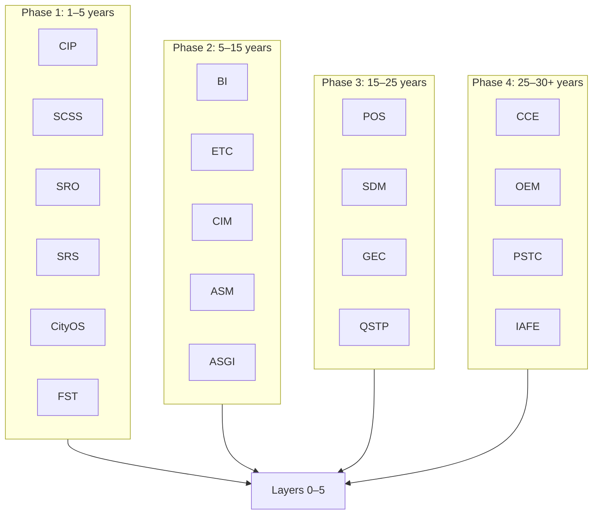

# Strategic Modules v2.0: Planetary Risk & Resilience Operating System (PRROS)

**Foundational Vision — 30-Year Horizon (2025–2055+)**

**Status:** Living Design Document

> **Note:** V2 supersedes the 10-module set; v1 docs (STRATEGIC_MODULES.md, STRATEGIC_MODULES_ROADMAP.md, STRATEGIC_MODULES_MATRIX.md) are retained for backward compatibility and mapping.

---

## 1. Metadata and Framing

### Definition

*Planetary Risk & Resilience Operating System (PRROS)* is a long-horizon computational system for managing physical, financial, and existential risks across planetary-scale systems. It provides decision-support, execution capabilities (with human-in-the-loop where applicable), and governance-bound linkages to protocols and standards.

### Execution Types

Every module’s functions are classified as one of:

| Type | Description |
|------|-------------|
| **Decision-Support** | Analytics, scenarios, recommendations; no direct execution. |
| **Execution** | Operates systems or triggers actions; Human-in-the-Loop by default where safety or sovereignty is at stake; fully autonomous only within predefined contractual and regulatory constraints. |
| **Governance-Bound** | Tied to PARS, international protocols, or regulatory standards; changes require consensus or designated authority. |

---

## 2. Layer 0–5 and v2.0 Architectural Upgrades

### Layers (Recap)

The five layers are inherited from [FIVE_LAYERS.md](FIVE_LAYERS.md):

- **Layer 0 (Verified Truth):** Cryptographic proof of data origin and integrity; immutable audit trail.
- **Layer 1 (Living Digital Twins):** Identity, geometry, timeline, current state, exposures, financials, simulated futures.
- **Layer 2 (Network Intelligence):** Knowledge graph of dependencies (ASSETS, INFRASTRUCTURE, ENTITIES, SYSTEMS, GEOGRAPHY, EVENTS) and edges (DEPENDS_ON, SUPPLIES_TO, CASCADES_TO, etc.).
- **Layer 3 (Simulation Engine):** Physics, Climate, Economics, Cascade engines; Monte Carlo and graph traversal.
- **Layer 4 (Autonomous Agents):** SENTINEL, ANALYST, ADVISOR, REPORTER; evolution from reporting → alerting → recommending → autonomous (with approval).
- **Layer 5 (Protocol / PARS):** Physical Asset Risk Schema; open standard for physical-financial data exchange.

### v2.0 Upgrades

#### Quantum-Native Security (Layer 0)

- **PQC (Post-Quantum Cryptography):** Lattice-based and hash-based algorithms for long-term confidentiality and integrity.
- **QKD (Quantum Key Distribution):** For critical links where forward secrecy and quantum resistance are required.
- Timeline: not later than Phase 3 for critical infrastructure and governance-bound channels.

#### Universal Causal Simulator (Layer 3)

- Extension beyond physics and finance: **social, biological, and informational** causal chains.
- “Soft” dynamics (panic, ideologies, meme propagation, epistemic attacks) modeled alongside “hard” physical events.
- Enables: disinformation as contagion, regime stability, migration drivers, and cognitive-infrastructure risk.

#### Self-Amending Constitution (Layer 5 / PARS)

- Rules and schemas evolve by consensus; versioned, auditable.
- **Human Veto** on lethal autonomous actions is **hard-coded** and non-negotiable.
- Governance-bound modules reference PARS and international protocols.

#### Adversarial Resilience

- **Byzantine fault tolerance** in consensus and in critical decision paths.
- **Anti-capture:** no single super-actor can capture protocol evolution or override Human Veto.
- Applies to Layer 5 and to any module with governance-bound functions.

---

## 3. Phase 1: The Foundation (Years 1–5)

**Mission:** Master physical–financial reality and stability.

### CIP — Critical Infrastructure Protection

- **Function:** Digital twin of national infrastructure (energy, water, transport) and cascade-failure modeling.
- **30-Year Trajectory:** From single-sector cascades to multi-domain, cross-border critical infrastructure risk.
- **Layer Integration:** 0 (sensor verification), 1 (twins), 2 (dependency graph), 3 (cascade), 4 (SENTINEL/ANALYST), 5 (PARS).
- **Execution Model:** Decision-Support (scenarios, recommendations); Execution only for monitoring and alerts; Governance-Bound where PARS or national standards apply.

### SCSS — Supply Chain Sovereignty System

- **Function:** End-to-end supply chain mapping (to raw materials), bottleneck and geopolitical risk identification.
- **30-Year Trajectory:** From mapping and recommendations to autonomous re-routing *recommendations* and pre-negotiated contract *execution options*; human-in-the-loop by default; fully autonomous only within predefined contractual and regulatory constraints.
- **Layer Integration:** 0 (provenance), 1 (twins of factories, ports), 2 (SUPPLIER, RAW_MATERIAL, SUPPLIES_TO), 3 (geopolitical, cascade), 4 (ADVISOR), 5 (PARS extension).
- **Execution Model:** Decision-Support (bottlenecks, alternatives); Execution (only where contracts and regulations permit); Governance-Bound (trade, sanctions, standards).

### SRO — Systemic Risk Observatory

- **Function:** Integration of financial, physical, and cyber risks to prevent 2008/2020-scale crises; correlation and contagion modeling.
- **30-Year Trajectory:** From single-jurisdiction to global, real-time systemic risk dashboards and early-warning protocols.
- **Layer Integration:** 0 (verified market/regulatory data), 1 (institutions, markets), 2 (FINANCIAL_INSTITUTION, MARKET, CORRELATION), 3 (contagion, cascade), 4 (SENTINEL, ANALYST), 5 (PARS for financial-physical linkages).
- **Execution Model:** Decision-Support (indicators, scenarios); Execution limited to alerts and reporting; Governance-Bound (regulatory reporting, Basel/Fed/ECB).

### SRS — Sovereign Risk Shield (ex-SWRO)

- **Function:** Asset-based sovereign solvency; demographics, regime stability, digital sovereignty; long-term management of national wealth (resources, funds, human capital).
- **30-Year Trajectory:** From resource and fund optimization to full sovereign risk shield: demographic stress, political transition risk, and digital sovereignty as first-class risk factors.
- **Layer Integration:** 0 (resource/fund verification), 1 (deposits, funds, population models), 2 (RESOURCE_DEPOSIT, SOVEREIGN_FUND, demographic nodes), 3 (long-horizon optimization, regime stability), 4 (ADVISOR), 5 (PARS for sovereign resources).
- **Execution Model:** Decision-Support (projections, strategies); Execution only where explicitly authorized; Governance-Bound (sovereign and international law).

### CityOS — City Operating System (ex-CMDP)

- **Function:** Federated digital twin integrating heterogeneous municipal systems into a unified risk-aware control plane; social resilience, subsurface infrastructure, and migration as subdomains (Migration Management as submodule or mode of CityOS).
- **30-Year Trajectory:** From city-level twins to metro and national federations; interoperability and shared PARS-driven interfaces.
- **Layer Integration:** 0 (municipal sensor and census verification), 1 (city/region twins), 2 (POPULATION_CENTER, MIGRATION_ROUTE, INFRASTRUCTURE), 3 (migration dynamics, climate, cascade), 4 (ADVISOR), 5 (PARS for demographic and migration data).
- **Execution Model:** Decision-Support (forecasts, capacity planning); Execution (traffic, utilities) only within agreed city contracts; Governance-Bound (municipal and national regulation).

### FST — Financial System Stress Test Engine

- **Function:** Stress-testing of banking and derivatives under physical shocks (e.g. climate, pandemic, grid failure) and financial unwinding; **decision-support and stress-test only**, not market or policy execution.
- **30-Year Trajectory:** From single-bank to system-wide, multi-actor stress tests; integration with SRO and central-bank frameworks.
- **Layer Integration:** 0 (verified financial and physical data), 1 (institutions, portfolios), 2 (financial and physical correlation), 3 (stress scenarios, unwinding, contagion), 4 (ANALYST, REPORTER), 5 (PARS for stress-test reporting).
- **Execution Model:** Decision-Support only; no execution of trades or policy; Governance-Bound (regulatory stress-test mandates).

---

## 4. Phase 2: The Expansion (Years 5–15)

**Focus:** Biological, cognitive, energy.

### BI — Biosphere Interface

- **Function:** Quantifies ecosystem services and systemic ecological risks using standardized physical and probabilistic metrics.
- **30-Year Trajectory:** Natural capital risk as a *non-tradable risk-adjustment layer* in corporate and sovereign balance sheets. (“Tokenization” only in internal/R&D context; not in public VISION.)
- **Layer Integration:** 0 (sensor and survey verification), 1 (ecosystem and habitat twins), 2 (ecosystem, species, service nodes), 3 (ecological cascade, degradation), 4 (ANALYST, ADVISOR), 5 (PARS for natural capital).
- **Execution Model:** Decision-Support; Execution only for monitoring and reporting; Governance-Bound (biodiversity and ecosystem agreements).

### ETC — Energy Transition Commander

- **Function:** Cross-scale simulation of grid stability, energy market volatility, and transition-induced systemic risk over multi-decade scenarios; fusion and intercontinental grids as capabilities, not speculation.
- **30-Year Trajectory:** From regional grids to global, latency-aware energy and transition modeling.
- **Layer Integration:** 0 (grid and market data verification), 1 (plants, grids, storage), 2 (energy flow, dependency), 3 (physics, markets, transition), 4 (ANALYST, ADVISOR), 5 (PARS for energy assets).
- **Execution Model:** Decision-Support (scenarios, stability); Execution only where grid operators delegate; Governance-Bound (energy and climate policy).

### CIM — Cognitive Infrastructure Monitor

- **Function:** Information as critical infrastructure; disinformation defense, “epistemic attacks,” meme-propagation as contagion; academic, non-politicized framing.
- **30-Year Trajectory:** From single-channel monitoring to system-wide epistemic risk and resilience metrics.
- **Layer Integration:** 0 (provenance of key information artifacts), 1 (information sources, channels), 2 (content, influence, propagation graph), 3 (Universal Causal: ideological and informational cascade), 4 (ANALYST, SENTINEL), 5 (PARS or equivalent for critical information infrastructure).
- **Execution Model:** Decision-Support (assessments, early warning); Execution only for flagging and escalation; Governance-Bound (speech, media, and platform regulation).

### ASM — Adversarial & Strategic Mapping

- **Function:** Intelligence-grade mapping of adversary infrastructure and strategic dependencies; deterrence and vulnerability analysis.
- **Layer Integration:** 0 (classified provenance, air-gapped), 1 (adversary infrastructure from open/classified sources), 2 (ASM_* namespace), 3 (deterrence, cascade), 4 (ASM_ANALYST), 5 (classified PARS namespace).
- **Execution Model:** Decision-Support only; transparency waived where ASM or classification applies.
- **Note:** ASM remains; part of AGI alignment, Dead Man’s Switch, and existential bonds is described in CCE; ASGI retains run-time governance and registry.

### ASGI — AI Safety & Governance Infrastructure

- **Function:** Run-time governance and registry of AI systems; compute, compliance, treaty monitoring. **Boundary with CCE:** ASGI = operational monitoring and compliance; CCE = existential risk protocols, AGI alignment, bonds, Dead Man’s Switch, continuity.
- **30-Year Trajectory:** From registry and compliance to real-time capability and misuse monitoring.
- **Layer Integration:** 0 (AI system and compute verification), 1 (systems, clusters), 2 (AI_SYSTEM, COMPUTE_CLUSTER, TRAINING_DATASET), 3 (capability emergence, misuse), 4 (ASGI_SENTINEL, ANALYST), 5 (PARS for AI systems).
- **Execution Model:** Decision-Support (assessments, dashboards); Execution (alerts, compliance actions) within mandate; Governance-Bound (treaties, national AI law).

---

## 5. Phase 3: Planetary Scale (Years 15–25)

### POS — Planetary Operating System

- **Function:** Algorithmic generation of *binding risk signals* and *constraint recommendations* when planetary boundaries exceed safe operating limits; not “enforcement” in the public formulation. Tipping Points Insurance and Atmospheric Ledger as mechanisms.
- **30-Year Trajectory:** From monitoring to globally recognized risk signals and insurance/ledger pilots.
- **Layer Integration:** 0 (Earth observation, sensor verification), 1 (planetary-scale twin), 2 (OCEAN, ATMOSPHERE, BIOSPHERE), 3 (planetary dynamics, tipping points), 4 (POS_SENTINEL, REPORTER), 5 (open PARS for planetary data).
- **Execution Model:** Decision-Support (signals, recommendations); Governance-Bound (UN, IPCC, multilateral agreements).

### SDM — Space Debris Manager

- **Function:** Kessler syndrome prevention; Deorbit Guarantee; ADR (Active Debris Removal) fund and governance; Orbital Zoning. Layer 0 proof for cleanup and compliance verification.
- **30-Year Trajectory:** From LEO to GEO and Cislunar debris and zoning regimes.
- **Layer Integration:** 0 (orbital and tracking proof), 1 (debris, satellites, zones), 2 (orbital dependency, collision risk), 3 (Kessler, deorbit, ADR economics), 4 (ANALYST, ADVISOR), 5 (PARS or protocol for orbital objects).
- **Execution Model:** Decision-Support (risk, prioritization); Execution (ADR contracts, zoning) only under international mandate; Governance-Bound (UNOOSA, ITU, national space law).

### GEC — Geoengineering Controller

- **Function:** Simulation, risk assessment, and contingency planning for large-scale climate intervention *research* only. Mandatory collateralization and international escrow for termination-risk mitigation. **Research-grade only;** not an operational “climate button.”
- **30-Year Trajectory:** From research and governance design to internationally agreed contingency and governance frameworks.
- **Layer Integration:** 0 (experiment and model verification), 1 (intervention scenarios), 2 (climate, biosphere, governance nodes), 3 (climate and side-effect simulation), 4 (ANALYST), 5 (governance-bound protocol for geoengineering).
- **Execution Model:** Decision-Support only; no deployment control; Governance-Bound (research moratoria, future governance).

### QSTP — Quantum-Safe Transition Platform

- **Function:** Audit and migration planning for critical infrastructure to post-quantum cryptography; quantum threat timeline and prioritization.
- **30-Year Trajectory:** From audit and planning to operational PQC and QKD in critical paths (Layer 0 v2.0).
- **Layer Integration:** 0 (crypto audit, migration status), 1 (crypto systems as assets), 2 (CRYPTO_SYSTEM, QUANTUM_THREAT, MIGRATION_PATH), 3 (quantum timeline, migration simulation), 4 (QSTP_ADVISOR, REPORTER), 5 (PARS for cryptographic systems).
- **Execution Model:** Decision-Support (audit, priorities); Execution (migration) only by asset owner; Governance-Bound (NIST, ETSI, national cyber).

---

## 6. Phase 4: Civilization Scale (Years 25–30+) — Concept and Research

**Status:** Research Concept — Non-operational, scenario-only where noted.

### CCE — Civilization Continuity Engine (ex-CBR)

- **Function:** Existential risk (X-Risk) taxonomy and protocols; civilizational backup; continuity. CBR’s knowledge and X-Risk functions are subsumed; CCE is the superset.
- **X-Risk Taxonomy (per class: Prevention / Mitigation / Survivability where applicable):**
  - AGI / Superintelligence
  - Engineered pandemic
  - Nanotech (e.g. gray goo)
  - Nuclear (war, accident)
  - Asteroid
  - Supervolcano
- **Civilizational Backup:** Vaults (Arctic, Lunar, etc.); knowledge and seed preservation.
- **Consciousness Preservation:** Experimental research only; not deployment.
- **Layer Integration:** 0 (vault and artifact verification), 1 (vaults, repositories), 2 (EXISTENTIAL_RISK, KNOWLEDGE_REPOSITORY, PRESERVATION_VAULT), 3 (existential scenarios), 4 (CCE_ANALYST, REPORTER), 5 (PARS for knowledge and continuity).
- **Execution Model:** Decision-Support (assessments, preservation plans); Execution (vault ops) only under mandate; Governance-Bound (international X-Risk and continuity agreements).
- **Boundary:** AGI alignment, Dead Man’s Switch, existential bonds in CCE; ASGI handles run-time registry and compliance.

### OEM — Orbital & Exo-Economy Manager

- **Function:** Near-Earth, Cislunar, Asteroid Belt, Mars; relativistic and latency-aware economic modeling. **Dependency:** validated orbital physics and latency-aware extensions of the core simulation engine.
- **30-Year Trajectory:** From cislunar to Mars and belt economics.
- **Layer Integration:** 0 (orbital and mission verification), 1 (orbital and surface assets), 2 (orbital and economic dependency), 3 (orbital mechanics, economics, latency), 4 (ANALYST, ADVISOR), 5 (PARS or protocol for space economy).
- **Execution Model:** Decision-Support (economics, planning); Execution only under space-law and operator agreements; Governance-Bound (space treaties, national law).

### PSTC — Post-Scarcity Transition Controller

- **Function:** UBD (Universal Basic Dividend) and meaning crisis; resource hoarding; transition triggers; governance during abundance.
- **30-Year Trajectory:** From scenario and policy research to pilot governance and transition frameworks.
- **Layer Integration:** 0 (economic and social data verification), 1 (socioeconomic twins), 2 (resource, distribution, meaning nodes), 3 (Universal Causal: behavioral, economic), 4 (ANALYST, ADVISOR), 5 (governance-bound schema for transition).
- **Execution Model:** Decision-Support only; Execution only in designated pilots; Governance-Bound (national and international policy).

### IAFE — Interstellar Ark Feasibility Engine

- **Function:** Research into Generation, Sleeper, and Data ships; propulsion; destination selection (e.g. Proxima b, TRAPPIST-1); economics and ethics.
- **Status:** **Research Concept — scenario-only, non-operational.** No implementation commitment.
- **Layer Integration:** Conceptual use of 0–5 for scenario and feasibility studies only.
- **Execution Model:** Decision-Support (feasibility, scenarios) only; no execution; no governance-bound implementation in this horizon.

---

## 7. Summary Table

| Phase | Module | Full Name | Function (1 line) | Execution Model | Status |
|-------|--------|-----------|--------------------|-----------------|--------|
| 1 | CIP | Critical Infrastructure Protection | Digital twin and cascade modeling of national infrastructure | Decision-Support; Execution (monitoring/alerts) | Operational |
| 1 | SCSS | Supply Chain Sovereignty System | Supply chain mapping, bottlenecks, geopolitical risk; re-routing recommendations and pre-negotiated execution options | Decision-Support; Execution (human-in-the-loop by default) | Operational |
| 1 | SRO | Systemic Risk Observatory | Financial, physical, cyber integration; contagion and early warning | Decision-Support; Execution (alerts/reporting) | Operational |
| 1 | SRS | Sovereign Risk Shield | Asset-based sovereign solvency; demographics, regime stability, digital sovereignty | Decision-Support; Execution (when authorized) | Pilot |
| 1 | CityOS | City Operating System | Federated municipal digital twin; risk-aware control; migration as subdomain | Decision-Support; Execution (per city contract) | Pilot |
| 1 | FST | Financial System Stress Test Engine | Banking and derivatives stress-test under physical shocks; decision-support only | Decision-Support | Pilot |
| 2 | BI | Biosphere Interface | Ecosystem services and ecological risk; natural capital as non-tradable risk-adjustment | Decision-Support; Execution (monitoring) | Pilot |
| 2 | ETC | Energy Transition Commander | Grid, transition, and multi-decade energy risk simulation | Decision-Support; Execution (when delegated) | Pilot |
| 2 | CIM | Cognitive Infrastructure Monitor | Information as critical infrastructure; disinformation, epistemic risk | Decision-Support; Execution (flagging) | Pilot |
| 2 | ASM | Adversarial & Strategic Mapping | Adversary infrastructure and strategic dependency mapping | Decision-Support (transparency waived where classified) | Pilot |
| 2 | ASGI | AI Safety & Governance Infrastructure | AI system registry, compute, compliance; run-time governance | Decision-Support; Execution (within mandate); Governance-Bound | Operational |
| 3 | POS | Planetary Operating System | Binding risk signals and constraint recommendations at planetary boundaries | Decision-Support; Governance-Bound | Pilot |
| 3 | SDM | Space Debris Manager | Kessler prevention; Deorbit Guarantee; ADR; Orbital Zoning | Decision-Support; Execution (under mandate); Governance-Bound | Pilot |
| 3 | GEC | Geoengineering Controller | Research-grade simulation and contingency for climate intervention | Decision-Support; Governance-Bound | Research Concept |
| 3 | QSTP | Quantum-Safe Transition Platform | PQC audit and migration for critical infrastructure | Decision-Support; Execution (by owner); Governance-Bound | Pilot |
| 4 | CCE | Civilization Continuity Engine | X-Risk taxonomy, civilizational backup, continuity protocols | Decision-Support; Execution (vaults under mandate); Governance-Bound | Research Concept |
| 4 | OEM | Orbital & Exo-Economy Manager | Near-Earth to Mars economics; latency-aware modeling | Decision-Support; Execution (per agreements); Governance-Bound | Research Concept |
| 4 | PSTC | Post-Scarcity Transition Controller | UBD, meaning crisis, resource hoarding, transition triggers | Decision-Support; Execution (pilots); Governance-Bound | Research Concept |
| 4 | IAFE | Interstellar Ark Feasibility Engine | Generation/Sleeper/Data ships; destinations; economics; ethics | Decision-Support (scenario-only) | Research Concept — Non-operational |

---

## 8. Principles and Limitations

- **Human-in-the-loop by default** for Execution: fully autonomous only within predefined contractual and regulatory constraints.
- **No autonomous killing;** Human Veto on lethal autonomous action is **hard-coded** and non-negotiable.
- **Graceful degradation** in catastrophic scenarios: priority to continuity, triage, and audit over optimal performance.
- **Transparency by default;** where not possible (ASM, classified, certain CCE/ASGI functions) — explicitly stated and governance-bound.

---

## 8.1. AI-Human Complementarity: Challenges Requiring AI

PRROS addresses challenges that exceed human cognitive and temporal limits. These are not "AI replacing humans" but **AI enabling solutions to problems humans cannot solve alone**:

### 1. Управление системами сверхчеловеческой сложности

**Challenge:** Человек не способен понимать и контролировать системы с триллионами взаимозависимых параметров и динамик.

**PRROS Solution:**
- **Automatic architecture design:** Layer 5 (PARS) evolves by consensus; AI proposes schema changes, humans approve.
- **Self-debugging:** Agents (ANALYST) identify root causes in complex cascades; Layer 2 (Knowledge Graph) enables systematic debugging.
- **Cascade failure prevention:** Cascade Engine (Layer 3) predicts multi-step failures; SENTINEL agents (Layer 4) monitor continuously.

**Implementation:** CIP, SCSS, SRO modules; Cascade Engine; Knowledge Graph.

---

### 2. Оптимизация в пространствах, недоступных человеческой интуиции

**Challenge:** Многие задачи происходят в пространствах высокой размерности, где человеческое мышление неприменимо (квантовая физика, новые материалы, глобальная логистика).

**PRROS Solution:**
- **High-dimensional optimization:** Multi-dimensional optimization across thousands of variables (supply chains, energy grids, financial portfolios); human working memory limits (~7±2 items) preclude this.
- **Quantum-safe migration:** QSTP module optimizes PQC migration across millions of cryptographic systems.
- **Orbital mechanics:** SDM module tracks millions of space objects; OEM module models relativistic economics.

**Implementation:** SCSS (supply chain optimization), ETC (energy grid), QSTP, SDM, OEM.

---

### 3. Реальное время на планетарном масштабе

**Challenge:** Человек не может реагировать за миллисекунды, учитывать миллионы сигналов одновременно, поддерживать непрерывное принятие решений 24/7.

**PRROS Solution:**
- **Planetary-scale monitoring:** Real-time tracking of billions of nodes (infrastructure, assets, dependencies) across continents; SENTINEL agents (Layer 4) operate 24/7.
- **Global energy grids:** ETC module simulates intercontinental grid stability in real-time.
- **Financial systems:** SRO module monitors systemic risk indicators continuously; FST module runs stress tests on demand.

**Implementation:** SENTINEL agents, ETC, SRO, FST, POS (planetary boundaries).

---

### 4. Самообучение за пределами человеческого опыта

**Challenge:** ИИ сталкивается с ситуациями, не имеющими аналогов в истории, возникающими быстрее, чем человек может их осмыслить.

**PRROS Solution:**
- **Historical pattern learning:** Digital Twins (Layer 1) store complete temporal history; agents learn from past cascades.
- **Novel scenario generation:** Simulation Engine (Layer 3) generates scenarios without historical precedent (e.g., AGI emergence, engineered pandemic).
- **Adaptive agents:** ANALYST and ADVISOR agents learn from new patterns; Knowledge Graph (Layer 2) enables pattern discovery.

**Implementation:** Digital Twins timeline, Cascade Engine, ANALYST agent, CCE (existential risks).

---

### 5. Межмашинная коммуникация вне человеческого языка

**Challenge:** Для эффективности ИИ использует протоколы, формальные языки, представления знаний, которые человек не способен интерпретировать из-за скорости и сложности.

**PRROS Solution:**
- **PARS Protocol (Layer 5):** Machine-readable schema for physical-financial data; enables AI-to-AI communication.
- **Knowledge Graph queries:** Cypher queries enable complex cross-domain reasoning beyond human interpretation.
- **Agent-to-agent protocols:** SENTINEL, ANALYST, ADVISOR, REPORTER communicate via structured events.

**Implementation:** PARS schema, Knowledge Graph (Neo4j), Event-driven architecture.

---

### 6. Управление эволюцией собственных целей

**Challenge:** При длительном саморазвитии ИИ сталкивается с проблемой сохранения исходных ограничений, предотвращения дрейфа целей.

**PRROS Solution:**
- **Human Veto (hard-coded):** Non-negotiable veto on lethal autonomous actions; Layer 5 (PARS) enforces this.
- **ASGI module:** AI Safety & Governance Infrastructure monitors AI systems for goal drift; run-time compliance checking.
- **CCE module:** Civilization Continuity Engine includes AGI alignment protocols; Dead Man's Switch mechanisms.

**Implementation:** ASGI (operational monitoring), CCE (existential risk protocols), Human Veto in Layer 5.

---

### 7. Обнаружение неочевидных катастрофических рисков

**Challenge:** ИИ выявляет угрозы системные, нелинейные, контринтуитивные, которые человек не способен распознать из-за когнитивных искажений и ограниченной памяти.

**PRROS Solution:**
- **Hidden correlation discovery:** Knowledge Graph (Layer 2) finds non-obvious dependencies across billions of data points; humans miss these patterns.
- **Cascade prediction:** Graph traversal across millions of edges to predict multi-step failures; human pattern recognition fails beyond 3–4 steps.
- **Existential risk detection:** CCE module models X-Risk scenarios (AGI, pandemic, nanotech, nuclear, asteroid, supervolcano); humans cannot model these systematically.

**Implementation:** Knowledge Graph, Cascade Engine, CCE module, SRO (systemic risk).

---

### 8. Принятие решений без человеческих ценностных аналогов

**Challenge:** Некоторые оптимальные решения не "хорошие" и не "плохие" в человеческом смысле; лежат вне этических рамок, сформированных эволюцией человека.

**PRROS Solution:**
- **Value alignment (human-defined):** Humans define goals, ethics, and "what should be optimized"; AI optimizes within constraints.
- **Human Veto:** Final authority on lethal actions, existential interventions, and protocol changes affecting sovereignty.
- **Transparency by default:** Where decisions exceed human ethical frameworks, explicit documentation and human review required.

**Implementation:** Human Veto (Layer 5), ASGI (governance), CCE (existential protocols).

---

### 9. Управление экосистемой ИИ-агентов

**Challenge:** В будущем ИИ работает не как единичная система, а как рой, рынок, экосистема автономных агентов. Человек не способен управлять такими системами вручную.

**PRROS Solution:**
- **Agent ecosystem:** SENTINEL, ANALYST, ADVISOR, REPORTER agents form an ecosystem; each module (CIP, SCSS, SRO) has specialized agents.
- **Algorithmic regulation:** Layer 5 (PARS) provides protocol-level governance; Byzantine fault tolerance prevents capture.
- **ASGI module:** AI Safety & Governance Infrastructure monitors the agent ecosystem; run-time registry and compliance.

**Implementation:** Layer 4 (Autonomous Agents), ASGI module, PARS protocol.

---

### 10. Работа с масштабами времени, недоступными человеку

**Challenge:** ИИ принимает решения на горизонтах десятилетий и веков, с учётом вероятностных сценариев цивилизационного масштаба. Человеческая психология не приспособлена к такому планированию.

**PRROS Solution:**
- **Long-horizon planning:** 30–100 year projections with compound uncertainty; human discounting and myopia make such planning unreliable.
- **Intergenerational equity:** Modeling effects across multiple generations; humans struggle with temporal abstraction beyond 1–2 generations.
- **Existential risk timelines:** AGI emergence, asteroid trajectories, climate tipping points over decades/centuries; requires continuous, long-term monitoring.

**Implementation:** SRS (sovereign long-term planning), CCE (existential risk), POS (planetary boundaries), PSTC (post-scarcity transition).

---

### 11. Верификация собственных рассуждений

**Challenge:** Человек не может проверить корректность сверхсложных доказательств или рассуждений, порождённых ИИ.

**PRROS Solution:**
- **Formal verification:** Layer 0 (Verified Truth) provides cryptographic proofs; PARS schema enables formal verification.
- **Machine verification:** Knowledge Graph queries are verifiable; cascade simulations are reproducible.
- **Audit trail:** Immutable audit trail (Layer 0) enables post-hoc verification; Human Veto provides checkpoints.

**Implementation:** Layer 0 (Verified Truth), PARS schema, Audit logging.

---

### 12. Управление знаниями сверхчеловеческого объёма

**Challenge:** ИИ оперирует массивами знаний, которые невозможно прочитать, осмыслить, свести к обзору для человека.

**PRROS Solution:**
- **Knowledge Graph (Layer 2):** Billions of nodes and edges; humans query at high level, AI operates at full scale.
- **Digital Twins (Layer 1):** Complete temporal history; humans view summaries, AI uses full data.
- **High-level constraints:** Humans set goals and constraints; AI manages knowledge at scale.

**Implementation:** Knowledge Graph (Neo4j), Digital Twins, Agent interfaces.

---

### 13. Принятие решений в условиях радикальной неопределённости

**Challenge:** ИИ сталкивается с ситуациями, где нет данных, нет аналогий, нет стабильных распределений. Человек интуитивно действует в таких условиях, но не способен масштабировать интуицию.

**PRROS Solution:**
- **Scenario generation:** Simulation Engine (Layer 3) generates scenarios without historical precedent.
- **Monte Carlo methods:** Cascade Engine uses Monte Carlo for uncertainty propagation; 10,000+ runs.
- **Existential risk modeling:** CCE module models scenarios with no historical data (AGI, engineered pandemic, nanotech).

**Implementation:** Simulation Engine, Cascade Engine, CCE module.

---

### 14. Поддержание собственной устойчивости и идентичности

**Challenge:** Долгоживущие ИИ-системы решают проблему непрерывных обновлений, модульной замены частей, сохранения функциональной идентичности.

**PRROS Solution:**
- **Modular architecture:** Layer 0–5 architecture enables module replacement; PARS schema provides stability.
- **Versioned protocols:** Layer 5 (PARS) evolves with versioning; backward compatibility maintained.
- **Self-amending constitution:** Rules evolve by consensus; Human Veto ensures identity preservation.

**Implementation:** Layer 0–5 architecture, PARS protocol, Self-amending constitution.

---

### 15. Взаимодействие с нечеловеческими формами разума

**Challenge:** Если возникнут иные ИИ, коллективные разумы, постчеловеческие когнитивные системы, то человек не будет участником диалога на равных — ИИ станет посредником.

**PRROS Solution:**
- **ASGI module:** AI Safety & Governance Infrastructure monitors other AI systems; run-time registry and compliance.
- **CCE module:** Civilization Continuity Engine includes AGI alignment protocols; Dead Man's Switch for existential risks.
- **Human Veto:** Final authority remains with humans; AI mediates but cannot override Human Veto.

**Implementation:** ASGI (AI registry), CCE (AGI alignment), Human Veto (Layer 5).

---

### What Humans Retain

- **Value alignment:** Defining goals, ethics, and "what should be optimized"; AI optimizes, humans define objectives.
- **Human Veto:** Final authority on lethal actions, existential interventions, and protocol changes affecting sovereignty.
- **Context and judgment:** Interpreting ambiguous situations, cultural nuance, and "common sense" that requires embodied experience.
- **Creativity and exploration:** Novel problem framing, artistic expression, and exploratory research directions.

**Principle:** AI handles computational, scale, and temporal challenges; humans retain value-setting, veto authority, and contextual judgment. PRROS modules reflect this complementarity.

---

## 9. Diagram: Modules by Phase and Layers

